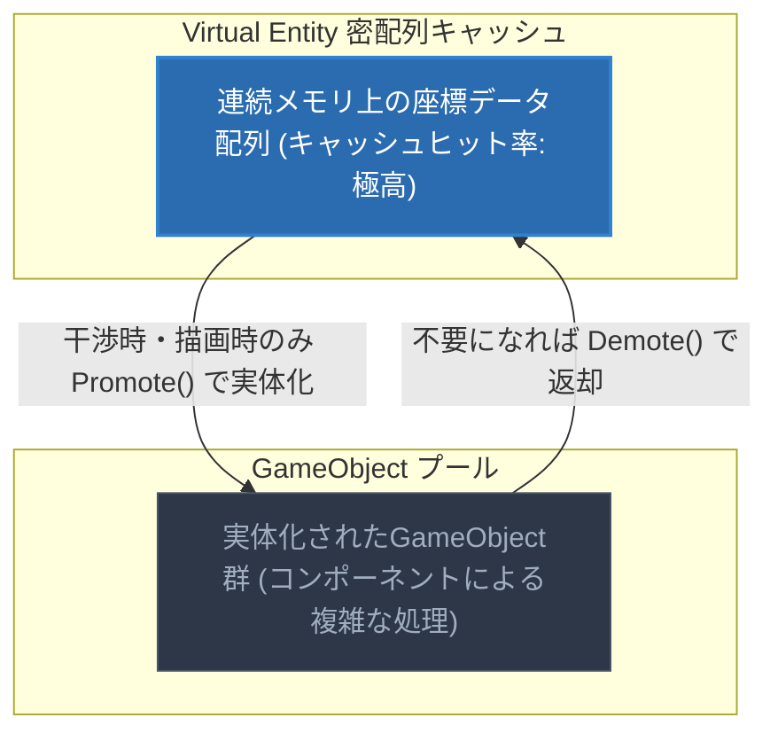
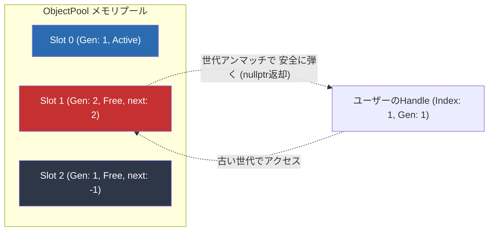

# Gravity Shooter / Irufemi Engine

[](https://irufemi.github.io/GravityShooter/)
[](https://github.com/Irufemi/CG3/actions/workflows/DebugBuild.yml)
[](https://github.com/Irufemi/CG3/actions/workflows/ReleaseBuild.yml)
[](https://github.com/Irufemi/CG3/actions/workflows/DevelopmentBuild.yml)
[](https://github.com/Irufemi/GravityShooter/actions/workflows/CheckUnwantedFiles.yml)

> 📖 **[【公式公開中】オンラインAPIドキュメント＆開発マニュアル (GitHub Pages)](https://irufemi.github.io/GravityShooter/)**

C++ と DirectX 12 を用いてスクラッチから構築した、**GPU-Driven Rendering** および **Data-Oriented Design** 指向の自作3Dゲームエンジンプロジェクトです。
商用AAAゲームエンジンにおけるパフォーマンス要求（ロード時間の極小化、万単位の動的オブジェクトの物理演算、空間分割による最適化）をクリアするための、最新アーキテクチャの実証を目的としています。

## 🎨 ポートフォリオ技術発表資料
本エンジン、および実装ゲームシステムに関する詳細な技術解説・スライド資料を公開しています。

> **【要約】自作エンジン「Irufemi Engine」の低レイヤにおける最適化（世代付きHandle、GPUフラスタムカリング、Bindless Resources）と、本エンジンを利用した個人2回・チーム4回のゲーム制作を支えたチーム開発支援機能の解説資料です。**
* **📄 [末廣公一_ポートフォリオ (PDF)](docs/Portfolio_Koichi_Suehiro.pdf)**
* **📄 [末廣公一_プログラム説明書 (PDF)](docs/ProgramSpec_Koichi_Suehiro.pdf)**
* **🌐 [公式オンラインAPIリファレンス＆マニュアル (GitHub Pages)](https://irufemi.github.io/GravityShooter/)**
  * ※PDF資料は本リポジトリの `docs/` ディレクトリ内に格納しています。

---

## 🎮 ショーケース：Irufemi Engineで開発されたゲーム群

本エンジンの大きな特徴は、「技術的なデモ」に留まらず、実際に**個人2回、チーム4回のゲーム制作**の基盤として利用され、他職種を含むチーム開発のイテレーションを支えた「拡張性と実用性の高さ」にあります。（※自身の累計制作経験：個人制作4回、チーム制作10回 / 計14作品）

| プロジェクト名 | 概要・ジャンル | 開発体制・期間 | 実装した主なエンジン機能 |
| :--- | :--- | :--- | :--- |
| **Gravity Shooter** | 奥スクロール型 重力シューティング | 1人 (約4ヶ月) | 最大1万個ベンチマーク耐性のガレキ制御（本編では視認性重視の最適密度循環）、スプライン相対追従、マルチロックオン、Dynamic BVH |
| **七転び八転び** | 3Dアクションゲーム | 4人 (約4ヶ月) | 非同期ローダー、Compute Shaderによる数十万ボクセル破壊、シーン管理・リソース管理 |
| **血管壊回** | 見下ろし型 疑似3Dアクション | 3人 (約1ヶ月) | 3Dパーティクルによる血流表現、XY平面ベースの2D/3D融合コリジョン処理 |
| **纏当て** | 3Dボスバトルアクション | 4人 (約1ヶ月) | DirectX 12 描画パイプラインの構築、デバッグUI環境の提供、描画用HLSLシェーダー |

---

## 🕹️ プレイ操作ガイド & キオスクモード (Controls & Kiosk Mode)

『Gravity Shooter』および本エンジン製ゲームは、展示会（BitSummit / TGS）や審査試遊での快適性を最重視した入力・ウィンドウ制御を標準搭載しています。

### 基本操作 (Controls)
| アクション | キーボード & マウス | コントローラー (XInput) |
| :--- | :--- | :--- |
| **移動** | `W` / `A` / `S` / `D` | 左スティック |
| **照準 (Aim)** | マウス移動 | 右スティック |
| **ガレキ引き寄せ (Pull)** | `マウス右クリック` / `E` | `LT` / `L1` |
| **ガレキ射撃 (Fire)** | `マウス左クリック` / `Space` | `RT` / `R1` |
| **ロックオン (Lock-On)** | `Shift` | `LB` |
| **ポーズ (Pause)** | `ESC` | `Start / Menu` |
| **全画面切替 (Fullscreen)** | `F11` または `Alt + Enter` | - |

### 🔒 展示・審査向けキオスクモード & 安全な終了導線 (Fail-Safe Exit)
- **Windowsキー誤爆防止**: 激しい操作によるOSスタートメニューの飛び出しを防ぐため、ゲーム実行中はWindowsキーを低レベルフック（`WH_KEYBOARD_LL`）で安全に無効化しています（フォーカスが外れると自動復帰します）。
- **ゲームの終了方法 (3系統の脱出経路)**:
  1. **ポーズメニュー**: `ESC` キーを押してポーズ画面を開き、**[QUIT]** を選択してクリーン終了。
  2. **ESCキー 2秒長押し**: 万が一の画面スタック時でも、`ESC` を2秒長押しすることでエンジンメインループから安全に強制シャットダウン（`PostQuitMessage(0)`）を発動。
  3. **`Alt + F4`**: OS標準の即時終了ショートカットは常に保証されています。

---

## 📊 技術的アピールポイント（最適化とモダンアーキテクチャ）

本エンジンにおける中核技術について、「実現したかった要件」「比較検討したトレードオフ」「結果と定量データ」の構成で解説します。

### <a id="desc-perf1"></a>🔹 1. 「処理落ち」の限界を広げるパフォーマンス最適化
> **【要約】最大10,000個の負荷耐性と、本編での視認性を最優先した最適循環チューニング**

- **【課題・実現したかったこと】**
  『Gravity Shooter』の基礎設計において、将来的な大規模戦闘や破壊表現に耐えうる「極限のスケーラビリティ」を確立したかった。また実際のゲーム本編では、画面がオブジェクトで埋まり弾幕が見えなくなるのを防ぎつつ、数十〜100個規模のガレキが「引き寄せ ➔ 旋回防御 ➔ 射出 ➔ 敵撃破でドロップ」という心地よい密度で循環するゲームループの実現を目指した。
- **【比較と技術選定 (トレードオフ)】**
  ポインタベースの `GameObject` (OOP) では、メモリ断片化によるキャッシュミスでCPUの限界（16.6ms）がすぐに訪れる。そこで、ゲーム進行に必要な当たり判定（OBB等）はCPUに残し、視覚的な「大量の破片の物理演算」のみを Compute Shader にオフロードした。さらに、ガレキ制御等の演算は真面目に行わず `sin/cos` を用いた「騙しの物理演算（Fake Physics）」で軽量化。データ管理には、座標データを密配列で保持する `VirtualEntityManagerComponent` (Sparse Set アーキテクチャ) を採用した。
- **【結果と定量的成果】**
  ・**【限界スケーラビリティ】**: 10,000オブジェクトの同時追尾ストレステストにおいて、CPU側のディスパッチ負荷を **平均0.066ms** に抑え、極限状態でも処理落ちしないスケーラビリティを実証。
  ・**【ゲーム本編の実運用】**: プレイヤーの視認性（弾幕の視認、敵の予兆検知）とゲームテンポを最優先し、本編中では数十〜100個のガレキが高密度かつ快適に物理循環するよう意図的に調整。余裕を持ったリソースをGPUボクセル破壊やポストプロセスに割り当て、常時60FPSの安定描画を達成した。
- 🔗 **関連コード原本**: [`VirtualEntityManagerComponent.h`](project/IrufemiEngine/Framework/Component/VirtualEntity/VirtualEntityManagerComponent.h)

> **📷 計測環境データ**
> ※ここに「1万個のガレキが飛んでいる画面」と「60FPSが出ているデバッグ表記」のスクリーンショットを配置してください。
> 計測条件：Releaseビルド, RTX 2060, オブジェクト数10,000個

**【図解: Sparse SetとInstance Promotionによるキャッシュ最適化】**


---

### <a id="desc-bvh"></a>🔹 2. Dynamic BVH とハードコードの排除
> **【要約】O(N log N)の動的AABBツリーとデータ駆動設計による衝突判定**

- **【課題・実現したかったこと】**
  マップごとの敵の出現位置や大量の背景をコードに直書きすると保守性が下がる。また、万単位のオブジェクトによる総当たり衝突判定（$O(N^2)$）のCPU負荷が課題だった。
- **【比較と技術選定 (トレードオフ)】**
  衝突判定を $O(N \log N)$ に落とすため動的AABBツリー (BVH) を実装。さらに、ツリーのノード管理をポインタで実装するとキャッシュミスが起きるため、あえてポインタを排し **「インデックスベースの配列プール」** を用いた Data-Oriented な実装を選択した。また、ウェーブや環境は JSON/CSV で外部定義し、`EnvironmentManagerComponent` でプーリングとバッチ描画（インスタンシング）を自動化するデータ駆動設計を導入した。
- **【結果と定量的成果】**
  プログラマ視点での高い保守性とシーンファイルの肥大化防止を達成。大量のガレキが密集してもFPSが落ちない安定した実行速度（CPUバウンドの解消）を実現した。
- 🔗 **関連コード原本**: [`EnvironmentManagerComponent.h`](project/Application_solo/components/EnvironmentManagerComponent.h)

> **📷 計測環境データ**
> ※ここに「BVHのデバッグ描画（四角い枠）」の画面か「`std::vector<BVHNode>` でプール管理しているコード」のスクリーンショットを配置してください。

---

### <a id="desc-memory"></a>🔹 3. 開発を止めない堅牢なメモリ管理と非同期・遅延処理
> **【要約】自前スレッドプールによる非同期ローダーと「世代付きHandle」の導入**

- **【課題・実現したかったこと】**
  高解像度テクスチャのロードがメインスレッドを占有し、アクションゲームで最も重要な「テンポ」を削ぐ数秒間のフリーズ（スパイク）を無くすこと。また、生成・消滅を繰り返す弾などのオブジェクトにおけるダングリングポインタのクラッシュ（アクセス違反）を未然に防止したかった。
- **【比較と技術選定 (トレードオフ)】**
  OS依存の `std::async` ではなく、ゲーム進行を極力阻害しないよう自前でワーカースレッド数と待機状態を制御できるスレッドプール (`ThreadPool`) を `std::mutex` を用いてスクラッチ実装。
  さらに、オブジェクトプールは生ポインタではなく **「世代(generation)付きHandle」** による管理へ移行。また、Updateループ中の直接削除による配列崩壊を防ぐため、**遅延削除キュー (Pending Kill)** を実装し、フレームの最後で一括返却するアーキテクチャを採用した。
- **【結果と定量的成果】**
  ロード中の最大スパイクを **約4100ms から 約51ms に激減**。また、古い世代のHandleアクセスを `nullptr` で弾き、遅延削除によってマルチスレッド環境や複雑なUpdateループ下でも安全で堅牢なゼロ・アロケーション基盤を構築できた。
- 🔗 **関連コード原本**: [`ThreadPool.h`](project/IrufemiEngine/Engine/Core/System/ThreadPool.h) / [`ObjectPool.h`](project/IrufemiEngine/Engine/Core/Utility/ObjectPool.h)

**【図解: 世代付きHandleによるダングリングポインタの防御】**


---

### <a id="desc-graphics"></a>🔹 4. AAA級のグラフィックスとGPU最適化
> **【要約】G-Bufferへの直接アクセス、GPU Culling、および Bindless Resources への対応**

- **【課題・実現したかったこと】**
  単なる3Dモデルではなく手描きコミックのようなリッチな線画表現や、内部で光が散乱する「煙の厚み」を描画したかった。また、数万のパーティクルや背景を描画する際のCPU側のカリング負荷・テクスチャバインド負荷を大幅に削減したかった。
- **【比較と技術選定 (トレードオフ)】**
  単一の輪郭線抽出ではなく、「深度」「法線」「輝度」の3つの G-Buffer から複合的にエッジを抽出するマルチレイヤー・アウトラインシェーダーを独自に実装。煙については、HLSLによるレイマーチングを実装し、「境界球（Bounding Sphere）」との交差判定を数学的に事前計算してサンプリング区間を最小限に絞り込んだ。
  最適化面では、**Compute Shader による GPU フラスタムカリング** を導入し `ExecuteIndirect` で一括描画。さらに、テクスチャバインドのオーバーヘッドをゼロにするため、**Bindless Resources (Descriptor Indexing)** への移行を達成した。
- **【結果と定量的成果】**
  自作エンジンだからこそ可能な G-Buffer への直接アクセスを活かし、3D空間ノイズ（FBM等）を用いた濃密な爆煙の質感を実現。同時に、数万のオブジェクトが描画されてもCPU側にカリング負荷・バインド負荷を大きく抑えたパイプラインを確立した。
- 🔗 **関連シェーダー**: [`ParticleGPU.PS.hlsl`](project/IrufemiEngine/EngineResources/shaders/ParticleGPU.PS.hlsl)

> **📷 計測環境データ**
> ※ここに「アウトラインや空間の歪みが綺麗にかかっているゲーム画面のアップ」と「可能なら 3つのG-Buffer の白黒サムネイル画像」を配置してください。

---

### <a id="desc-manual"></a>🔹 5. チーム開発を成功に導くツールとドキュメンテーション
> **【要約】Facadeパターン、リフレクションUI、および2万文字の開発ガイドライン**

- **【課題・実現したかったこと】**
  チーム開発において、高度なGPU処理を知らないプランナーや他プログラマーでも、ゲームを実行したままリアルタイムにバランス調整ができ、安全かつ効率的に開発を進められるようにしたかった。
- **【比較と技術選定 (トレードオフ)】**
  C++側で変数を登録するだけで自動的にImGuiのインスペクタUIが生成・JSON保存されるリフレクション基盤を提供。また、GPU側の複雑な事前確保（プレウォーム）やパーティクル生成をカプセル化した Facade パターンによる直感的なAPI設計を導入した。
  さらに、暗黙の了解を防ぐため「Handleの使い方」や「遅延削除のルール」をまとめた独立した **Manual (取扱説明書)** を作成した。
- **【結果と定量的成果】**
  再コンパイルの待ち時間が消滅し、チーム全体のイテレーション速度が劇的に向上。**2万文字規模**（2100行以上）のマニュアルを執筆し、「作って、試して、共有する」エンジニアとしてチームの開発基盤を強固に支えることができた。
- 📄 **関連ドキュメント原本**: [`Manual.md`](Manual.md)

---

## 🚀 開発ロードマップ & 実装機能一覧

本エンジンで実証・実装された主な機能群です。

- [x] **入力システム (Enhanced Input)**: JSONデータ駆動の論理アクション、厳格修飾子排他 (Strict Modifier Matching)、入力消費 (`ConsumeKey`)
- [x] **ウィンドウ & キオスク制御**: `F11` / `Alt+Enter` エンジンコア集約トグル、低レベルフックによるWindowsキー無効化と3重の安全脱出導線
- [x] **PSOキャッシュ & 並列PreWarm**: 全CPUコアによる事前マルチスレッド並列JITコンパイル（初回到達時スタッター完全ゼロ化）
- [x] **DirectX 12 描画基礎**: パイプライン、シェーダバインド、定数バッファ管理
- [x] **アーキテクチャ最適化**: Bindless Resources (Descriptor Indexing) への対応
- [x] **メモリ管理**: 世代(Generation)付きHandleによる安全なObjectPool、スタックアロケータ、遅延削除(Pending Kill)キュー
- [x] **非同期・マルチスレッド**: 自作 `ThreadPool` による非同期ローダー（Time-Slicing化）、非同期レイキャスト `RaycastAsync`
- [x] **衝突最適化**: Dynamic BVH (O(N log N)) 空間分割、データ指向の密配列キャッシュ (Sparse Set)
- [x] **グラフィックス強化**: G-Buffer (MRT) ベースの高品質マルチレイヤーアウトライン、GPU Skinning、GPU フラスタムカリング (`ExecuteIndirect`)、Compute Shader パーティクル
- [x] **デバッグ・開発ツール**: ImGui の統合（3カラムインスペクター）、リフレクションによる自動UI生成、Prefab (JSON) の動的ロード

---

## 📖 API利用例 (API Usage)

チームメンバーが直感的に利用でき、かつ内部では高度な最適化が働くAPIの設計例です。

### 1. リフレクションによるエディタUIの自動生成
変数を登録するだけで、ImGuiのインスペクタにUIが自動生成され、実行中のパラメータ変更とJSON保存が可能になります。

```cpp
#include "Framework/Component/Component.h"

class PlayerStatusComponent : public Component {
public:
    int hp_ = 100;
    float speed_ = 5.0f;

    std::string GetComponentName() const override { return "PlayerStatusComponent"; }

    void OnRegisterProperties() override {
        // これだけで Inspector に UI が自動生成＆ JSON に連動
        RegisterProperty("Max HP", &hp_);
        RegisterProperty("Move Speed", &speed_);
    }
};
```

### 2. スレッドプールを用いた非同期レイキャスト (Async Raycast)
メインスレッドを停止させない分散処理（Time-Slicing）による当たり判定の例です。

```cpp
// 毎フレーム判定するのではなく、一定時間ごとに非同期でRaycastを発行
if (timeSinceLastCheck > 0.1f) {
    auto* collisionManager = engine_->GetCollisionManager();
    // 非同期でレイキャストを発行し、結果を future として受け取る
    raycastFuture_ = collisionManager->RaycastAsync(engine_->GetThreadPool(), ray, maxDistance, layerMask);
    timeSinceLastCheck = 0.0f;
}

// 別のフレームで、判定が完了しているかチェックして結果を受け取る (ノンブロッキング)
if (raycastFuture_.valid() && raycastFuture_.wait_for(std::chrono::seconds(0)) == std::future_status::ready) {
    auto [isHit, hitInfo] = raycastFuture_.get();
    if (isHit) {
        // ヒットした場合の処理
    }
}
```

---

## 📁 プロジェクト構成 (Project Structure)

本ソリューション (`Irufemi.slnx`) は、エンジンコアとアプリケーション（ゲームロジック）、およびツール群を明確に分離（関心の分離）した以下の4プロジェクトで構成されています。

| プロジェクト | 種別 | 役割 |
| :--- | :--- | :--- |
| **IrufemiEngine** | 静的ライブラリ (.lib) | 描画・物理・リソース・コンポーネント基盤を提供するエンジンコア |
| **IrufemiEditor** | 静的ライブラリ (.lib) | ImGuiベースのレベルエディタ・デバッグツール群 |
| **Application_solo** | 実行ファイル (.exe) | 個人制作ゲームのロジック・固有シーン・アセンブリ |
| **Application_team** | 実行ファイル (.exe) | チーム制作ゲームのロジック・固有シーン・アセンブリ |

### ⚙️ IrufemiEngine (`project/IrufemiEngine/`)
エンジンのコアモジュール群です。特定のゲームに依存する処理は一切含みません。

| ディレクトリ | 役割 |
| :--- | :--- |
| **Engine/** | DirectX12ラッパー、ウィンドウ管理、スレッドプール、各種Manager群 |
| **Renderer/** | RenderGraph、G-Buffer、Bindless Resources パイプライン |
| **Resource/** | Handleシステムを用いた非同期テクスチャ・モデル・オーディオ管理 |
| **Framework/** | Componentを用いた高速なECS基盤、Dynamic BVH 衝突判定 |

### 🎮 Application (`project/Application_solo/` 等)
ゲーム固有のロジックとリソースを格納します。

| ディレクトリ | 役割 |
| :--- | :--- |
| **components/** | ゲーム固有の振る舞い (DebrisManager, Boss 等) |
| **scene/** | 各シーンの初期化と状態管理 |
| **resources/** | このゲーム専用のテクスチャ、モデル、JSON等のアセット群 |

### 🛠️ Tools & External Editors (`tools/`)
ゲーム制作イテレーションを高速化する外部ツール群です。
- **`tools/BlenderLevelEditor/`**: Blenderを3Dレベルエディタとして拡張する公式アドオン群。
  - レールシューターのスプライン軌道編集、敵配置オーサリング、JSONエクスポートに対応。
  - 環境非依存の多層自動検出ランチャー（`Launch_BlenderLevelEditor.bat`、`Sync_BlenderAddon.bat`）および説明書PDF（`docs/`）を完備。

### 💾 派生データとアセットの3層分離設計
Unreal EngineのDDC（Derived Data Cache）思想を取り入れ、リポジトリの健全性を保つ3層分離を徹底しています。
- **`asset_src/` (DCC原本層)**: `.blend` 元データ、原本フォント、高解像度テクスチャ（ランタイムには含めない）。
- **`project/Application_solo/resources/` (ランタイム層)**: ゲーム実行に必要な最適化済みアセットのみを格納（未参照ファイルの混入ゼロ）。
- **`generated/cache/` (派生データ・キャッシュ層)**: 高速パース済みモデル（`.model.ibin`）やDirectX12 PSOキャッシュ（`*.pso`）をアセット領域から完全隔離。

---

## 🛠️ 開発効率化を支える自作ツール・エコシステム

エンジン単体にとどまらず、ゲーム開発・プロファイリングのイテレーションを加速させるための独立ツール群を開発・統合しています。

| ツール / エディタ | 技術スタック / プロトコル | 特徴と設計のこだわり |
| :--- | :--- | :--- |
| **リアルタイム・テレメトリ監視ツール (`TelemetryMonitor`)** | C# / WPF (.NET 10)<br>**UDP通信 (Port: 8888)** | **【ゲームループ無負荷設計】** プロファイリング自体がゲームの動作を重くしては本末転倒であるため、TCPのようなハンドシェイク・再送待ちによるブロッキングを避け、**軽量なUDP通信**を採用。ゲームエンジン側は専用の独立ワーカースレッド（`std::thread` + `std::condition_variable`）から非同期送信することで、**ゲーム本体のメインループ・フレームレートに一切の負荷を与えない監視環境**を実現。GPUパーティクル数、CPU負荷、FPSを外部GUIからリアルタイム監視可能。 |
| **インハウス・ゲームエンジンエディタ (`IrufemiEditor`)** | C++ / DirectX 12 / ImGui | **【商用エンジン級の操作性】** Commandパターンによる**完全なUndo/Redo**、ドラッグ＆ドロップによる階層移動、3Dシーンビュー、階層ツリー、プロジェクトブラウザを完備。ボス行動ステートやスプラインウェイポイントを視覚的に編集できるカスタムインスペクター拡張基盤を搭載。 |

---

## 🛠️ 自動ビルド＆パッケージングパイプライン

大手ゲーム会社のCI/CD・デリバリーパイプラインを模した自動化スクリプト群をリポジトリルートに配備しています。

| ツール / スクリプト | 役割・特徴 |
| :--- | :--- |
| **`CompileShaders.bat`** | 全77種以上のHLSLシェーダーを `/O3` 最適化で先行オフラインコンパイル。審査員環境でのDirectXランタイムDLL依存クラッシュを根本から防止します。 |
| **`CleanAssets.bat`** | `.gitignore` に準拠し、`generated/cache/` や `logs/` などの一時生成物を安全に一括消去するアセット＆ワークスペース健全化ツール。 |
| **`scripts/PackageForSubmission.ps1`** | SEGA等の企業提出規定に完全準拠したパッケージ自動生成パイプライン。「クリーンなソースコード提出用ZIP」と「依存関係ゼロで即起動するプレイ用exeパッケージZIP」をワンクリックで生成します。 |

---

## 🎨 アセットパイプライン

### 1. 3Dモデルのエクスポート
- **ルール**: Blender等のツールでは **デフォルト設定（Y-up / 右手座標系）** でエクスポートしてください。
- **処理**: エンジン内部（Assimp読み込み時）でDirectX用の左手座標系へ自動変換されます。

### 2. テクスチャ命名規則 (Linear Workflow)
リニアワークフローを正確に行うため、ファイル名による自動判別を行っています。
- **数値データ (Linear)**: 接尾辞 `_n`, `_ao`, `_m`, `_r` を含めることでガンマ補正をスキップします。
- **カラーデータ (sRGB)**: 上記以外はすべて色として扱われ、自動的にリニアライズされます。

---

## ⚙️ 動作環境・計測環境

- **OS**: Windows 10 / 11
- **IDE**: Visual Studio 2022 (v17.10以降) / Visual Studio 2026
- **SDK**: Windows SDK 10.0.26100.7175 以上推奨
- **計測環境**: 
  - CPU: Intel Core i7 / AMD Ryzen 7 相当以上
  - GPU: NVIDIA RTX 2060 相当以上を想定

**ビルド手順**:
1. リポジトリをクローン後、Visual Studio 2022 (v17.10以降) または VS2026 で `Irufemi.slnx` を開きます。
2. 構成を選択しビルドを実行します。
  - `Debug` / `Development`: エンジン実行時に動的コンパイルされ、迅速なイテレーションが可能。
  - `Release`: Visual Studio の PreBuild イベントで最高レベルの最適化 (`/O3`) を適用したオフラインコンパイルが行われます。

---

## 📚 使用ライブラリ

- [Assimp](https://github.com/assimp/assimp)
- [Dear ImGui](https://github.com/ocornut/imgui)
- [DirectX 12 Agility SDK](https://devblogs.microsoft.com/directx/directx12agility/)

---

## 📄 ライセンス

このエンジンのソースコードは [MIT License](LICENSE.txt) の下で提供されています。各ライブラリのライセンスについては個別の規定に従ってください。
