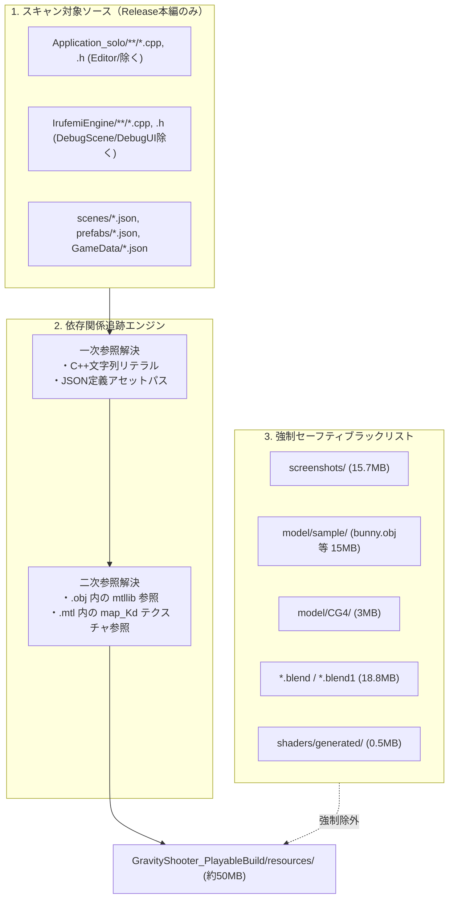

# ビルド ＆ パッケージングパイプライン技術仕様書

本リポジトリにおける、Visual Studio 2026 自動ビルド、スマートアセットクッカー、および就職活動・技術審査用パッケージ生成ツールの技術仕様書です。

---

## 1. ツール構成と配置ルール

大手ゲーム開発スタジオおよび商用エンジンの標準に準拠し、**「人間が触るエントリーポイント（窓口）」をルート直下** に、**「内部スクリプト（ビジネスロジック）」を `scripts/` 配下** に分離しています。

```text
WP0/
├── BuildAndRun.bat              <-- 【窓口】ワンクリックでReleaseビルド ＆ ゲーム起動
├── PackageForSubmission.bat      <-- 【窓口】ワンクリックで審査提出用パッケージを生成
├── README.md
├── Manual.md
├── project/
│   ├── Irufemi.slnx             <-- VS2026 XMLソリューション
│   └── CompileShaders.bat       <-- ソリューション層のオフラインシェーダーコンパイルタスク
└── scripts/
    ├── build_and_run.ps1        <-- ビルド＆起動本体スクリプト
    ├── PackageForSubmission.ps1 <-- 提出用パッケージ生成＆スマートアセットクッカー本体
    └── README.md                <-- 本仕様書
```

---

## 2. 各ツールの機能仕様

### 2.1 `BuildAndRun.bat`
- **目的**: 審査員や開発者が、Visual Studio を起動せずにワンクリックで最新ゲームをテストプレイできるようにする。
- **実行内容**:
  1. `vswhere.exe -latest -prerelease` により Visual Studio 2026 の MSBuild を自動検出。
  2. 新規クローン環境対策として `-restore` を付与し、NuGet パッケージ（`freetype2`）を自動復元。
  3. `Irufemi.slnx` に対して `/t:Application_solo /p:Configuration=Release /p:Platform=x64` を実行。
     - エンジン層（`IrufemiEngine.lib`）や外部ライブラリ（`imgui`, `DirectXTex`）の依存関係を先に解決してビルド。
     - PreBuildEvent により `CompileShaders.bat` が走り、HLSL を事前コンパイル。
  4. ビルド成功後、作業ディレクトリを `project/Application_solo` に移動し、`Application_solo.exe` を即座に起動。

---

### 2.2 `PackageForSubmission.bat`
- **目的**: 就職活動やコンテスト応募に向けた「完全な提出用パッケージ」を全自動で生成する。
- **出力先**: `_Submission/` 配下
  - `GravityShooter_PlayableBuild/`（プレイ用パッケージ: **約 62 MB**）
  - `GravityShooter_SourceCode/`（ソースコード提出用パッケージ: **約 538 MB**）

#### メニュー構成
```text
  [1] プレイ用パッケージ（最新コードを Release ビルド ＋ スマートクックで極限軽量化） ★推奨
  [2] プレイ用パッケージ（既存 Exe を使用 ＋ スマートクック生成）
  [3] ソースコード提出用パッケージ (クリーン開発モード・完全整合版)
  [4] 両方一括生成（Release ビルド後に両パッケージを作成） ★審査提出時推奨
  [Q] 終了
```

---

## 3. スマートアセットクッカー（手法B）のアルゴリズム

プレイ用パッケージにおいて、**ゲーム本編で使われない未使用アセット（約130MB）を安全に排除** するための依存関係追跡仕様です。



### 3.1 探索除外ルール（デバッグ汚染の防止）
`DebugScene.cpp` や `DebugUI.cpp` 内に書かれたデバッグ用モデル（`sample/bunny.obj` 等）は、探索対象から明示的に除外されているため、**プレイ用配布物にテスト用モデルが漏れ出る事故を 100% 防止** します。

### 3.2 多層参照（間接参照）の解決
- モデル（`.obj`）が検出された場合、内部の `mtllib <name>.mtl` を自動検出してマテリアルを保護。
- マテリアル（`.mtl`）内の `map_Kd <name>.jpg` などを自動検出してテクスチャを保護。
- これにより、**「C++にモデル名しか書いていなくても、テクスチャが抜けて真っ白になる事故」を完全に防止** します。

---

## 4. 新規アセット追加・運用のガイドライン

将来新しいアセットを追加する際は、以下のルールを守ることで、クッカーが自動的に検出してパッケージに含めます。

### ① モデルとテクスチャの配置
- `.obj` と `.mtl`、および対応するテクスチャ画像（`.png`, `.jpg`）は **同じフォルダ内** に配置してください。
- `.mtl` ファイル内の `map_Kd` 行に記述されるテクスチャファイル名と、実際のテクスチャ名が一致していることを確認してください。

### ② C++ コードでのハードコードロード
- C++ から直接アセットをロードする場合、ファイル名または相対パスを文字列リテラルとして記述してください。
  ```cpp
  // 推奨: パスまたは特徴的なファイル名で記述
  modelManager->Load("model/boss_drone/boss_drone.obj");
  audioManager->Play("se_player_shoot.wav");
  fontManager->LoadFont("fonts/toro_glitch.otf");
  ```

### ③ 配布用パッケージに含めたくない開発用ファイル
- 作業用のスクリーンショットは `resources/screenshots/` 配下に保存してください（自動除外されます）。
- Blenderの作業データ（`.blend`, `.blend1`）は `resources/` 内に置かれていても自動的に除外されます。
- テスト用の仮アセットは `resources/model/sample/` 配下に配置してください（自動除外されます）。

---

## 5. トラブルシューティング

| 現象 | 原因と確認ポイント | 対処法 |
| :--- | :--- | :--- |
| **プレイ用パッケージにアセットが含まれない** | コードやJSON内の文字列と、実際のファイル名/拡張子にズレがある。 | ファイル名が C++ のロード処理や JSON 内で正確に参照されているか確認してください。 |
| **テクスチャが白抜けしている** | `.obj` 内の `mtllib` 指定、または `.mtl` 内の `map_Kd` のファイル名が実際の画像名と不一致。 | テキストエディタで `.obj` と `.mtl` を開き、記述されている画像ファイル名を確認してください。 |
| **ビルドで NuGet エラーが出る** | クローン直後で `packages/` が空。 | パイプラインは自動で `-restore` を実行しますが、手動で行う場合は VS で「NuGetパッケージの復元」を実行してください。 |
